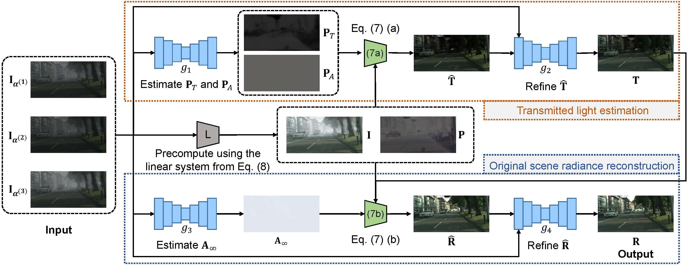

# Learning to Dehaze with Polarization

By [Chu Zhou](https://fourson.github.io/), Minggui Teng, Yufei Han, Chao Xu, [Boxin Shi](http://ci.idm.pku.edu.cn/)


[PDF](https://papers.nips.cc/paper/2021/file/5fd0b37cd7dbbb00f97ba6ce92bf5add-Paper.pdf) | [SUPP](https://papers.nips.cc/paper/2021/file/5fd0b37cd7dbbb00f97ba6ce92bf5add-Supplemental.pdf)


## Abstract
Haze, a common kind of bad weather caused by atmospheric scattering, decreases the visibility of scenes and degenerates the performance of computer vision algorithms. Single-image dehazing methods have shown their effectiveness in a large variety of scenes, however, they are based on handcrafted priors or learned features, which do not generalize well to real-world images. Polarization information can be used to relieve its ill-posedness, however, real-world images are still challenging since existing polarization-based methods usually assume that the transmitted light is not significantly polarized, and they require specific clues to estimate necessary physical parameters. In this paper, we propose a generalized physical formation model of hazy images and a robust polarization-based dehazing pipeline without the above assumption or requirement, along with a neural network tailored to the pipeline. Experimental results show that our approach achieves state-of-the-art performance on both synthetic data and real-world hazy images.
## Prerequisites

* Linux Distributions (tested on Ubuntu 18.04).
* NVIDIA GPU and CUDA cuDNN
* Python >= 3.7
* Pytorch >= 1.1.0
* cv2
* numpy
* tqdm
* tensorboardX (for training visualization)

## Inference

```
python execute/infer_full.py -r checkpoint/full.pth --data_dir <path_to_input_data> --result_dir <path_to_result_data> default
```

## Pre-trained models and test examples

https://drive.google.com/drive/folders/1FwO--21K9GmsS6iGNm44tHMfAoDn6fNs?usp=sharing

## Visualization

Since the file format we use is `.npy`, we provide scrips for visualization:
* use `scripts/visualize_polarized_img.py` to visualize the polarized hazy images
* use `scripts/visualize_img.py` to visualize the unpolarized hazy images and synthetic results
* use `scripts/visualize_real_img.py` to visualize real results

## Preprocess your own data

Note that in our code implementation, the network input contains three components: `{I_alpha, I_hat, delta_I_hat}`:
* `I_alpha`: three polarized hazy images
* `I_hat`: the calculated unpolarized hazy image
* `delta_I_hat`: the calculated unpolarized hazy image multiplied by the degree of polarization

So, we should preprocess the data first to get the network input:

* for synthetic images (training and inference)
    1. use `scripts/preprocess_cityscapes.py` to preprocess the [Cityscapes Dataset](https://www.cityscapes-dataset.com/) (require leftImg8bit, gtFine, and leftImg8bit_transmittanceDBF) for generating `{image, depth, segmentation}` (or choose other source dataset if you want)
    2. use `scripts/make_dataset.py` to generate the synthetic dataset from `{image, depth, segmentation}`
   
* for real images (inference only)
    1. use `scripts/make_real_dataset_from_raw_format.py` to generate the real dataset from images (in `.raw` format) captured by a polarization camera (Lucid Vision Phoenix polarization camera (RGB) in our paper)

## Training your own model

1. stage1 (Transmitted light estimation):
    ```
    python execute/train.py -c config/subnetwork1.json
    ```

2. stage2 (Original scene radiance reconstruction):
    ```
    python execute/train.py -c config/subnetwork2.json
    ```
   
3. finetune the entire network:
    ```
    python execute/train.py -c config/full.json --T_model_checkpoint_path <path_to_stage1_checkpoint> --R_model_checkpoint_path <path_to_stage2_checkpoint> 
    ```

* All config files (`config/*.json`) and the learning rate schedule function (MultiplicativeLR) at `get_lr_lambda` in `utils/util.py` could be edited

## Citation

If you find this work helpful to your research, please cite:

```
@inproceedings{NEURIPS2021_5fd0b37c,
 author = {Zhou, Chu and Teng, Minggui and Han, Yufei and Xu, Chao and Shi, Boxin},
 booktitle = {Advances in Neural Information Processing Systems},
 editor = {M. Ranzato and A. Beygelzimer and Y. Dauphin and P.S. Liang and J. Wortman Vaughan},
 pages = {11487--11500},
 publisher = {Curran Associates, Inc.},
 title = {Learning to dehaze with polarization},
 url = {https://proceedings.neurips.cc/paper/2021/file/5fd0b37cd7dbbb00f97ba6ce92bf5add-Paper.pdf},
 volume = {34},
 year = {2021}
}
```


